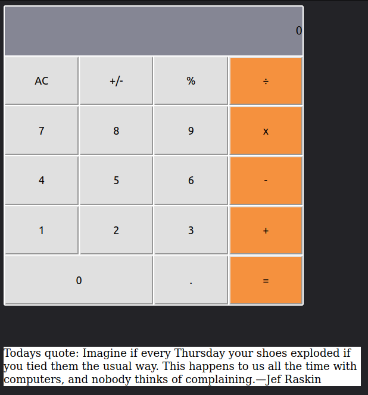

<!-- TABLE OF CONTENTS -->

# 📗 Table of Contents

- [📗 Table of Contents](#-table-of-contents)
- [📖  Math Magicians ](#--Math_Magicians-)
  - [🛠 Built With ](#-built-with-)
    - [Tech Stack ](#tech-stack-)
    - [Key Features ](#key-features-)
  - [💻 Getting Started ](#-getting-started-)
    - [Prerequisites](#prerequisites)
    - [Setup](#setup)
    - [Usage](#usage)
    - [Run tests](#run-tests)
  - [👥 Authors ](#-authors-)
  - [🔭 Future Features ](#-future-features-)
  - [🤝 Contributing ](#-contributing-)
  - [⭐️ Show your support ](#️-show-your-support-)
  - [🙏 Acknowledgments ](#-acknowledgments-)
  - [📝 License ](#-license-)

<!-- PROJECT DESCRIPTION -->
# 📖  Math Magicians <a name="Math_Magicians"></a>

> 'Math magicians' is a website for all fans of mathematics. It's a Single Page App (SPA) that allows users to make simple calculations and read a random computer-related quote.



## 🛠 Built With <a name="built-with"></a>
- Technology: HTML, CSS & JS and RAECT
- Tools: VS Code, GIT, GITHUB

### Tech Stack <a name="tech-stack"></a>
<details>
  <summary>Client</summary>
  <ul>
    <li><a href="https://developer.mozilla.org/en-US/docs/Web/HTML">HTML</a></li>
    <li><a href="https://developer.mozilla.org/en-US/docs/Web/CSS">CSS</a></li>
    <li><a href="https://developer.mozilla.org/en-US/docs/Web/JavaScript">JavaScript</a></li>
    <li><a href="https://react.dev/">React</a></li>
  </ul>
</details>

<p align="right">(<a href="#readme-top">back to top</a>)</p>

<!-- Features -->

### Key Features <a name="key-features"></a>

Just a simple calculator, nohting fancy.

<p align="right">(<a href="#readme-top">back to top</a>)</p>

<!-- GETTING STARTED -->
## 💻 Getting Started <a name="getting-started"></a>
To get a local copy up and running, follow these steps.

### Prerequisites

You have to use this tools in your local machine.

- NPM or better yet, PNPM
- GIT & GITHUB
- Any Code Editor (VS Code, Brackets, etc)

### Setup

Clone this repository to your desired folder:
Example commands:

```sh
git clone https://github.com/Goldinium/math_magicians.git
cd math_magicians
npm install # to install dependencies
```


### Usage
To run the project on your local machine, execute the following command:

```sh
npm run build
serve -s build
```


### Run tests

To run tests, run the following commands on terminal:

Test for webhint errors
```sh
npx hint .
```

Test for stylelint errors
```sh
npx stylelint "**/*.{css,scss}"
```

Test for eslint errors
```sh
npx eslint .
```

<!-- AUTHORS -->

## 👥 Authors <a name="authors"></a>

👤 **Ben**
- GitHub: [@Goldinium](https://github.com/Goldinium)


<p align="right">(<a href="#readme-top">back to top</a>)</p>


<!-- FUTURE FEATURES -->

## 🔭 Future Features <a name="future-features"></a>

- Add math logic to enable arithmetics


<p align="right">(<a href="#readme-top">back to top</a>)</p>

<!-- CONTRIBUTING -->

## 🤝 Contributing <a name="contributing"></a>
Contributions, issues, and feature requests are welcome!

Feel free to check the [issues page](https://github.com/Goldinium/math_magicians.git/issues).

<p align="right">(<a href="#readme-top">back to top</a>)</p>

<!-- SUPPORT -->

## ⭐️ Show your support <a name="support"></a>
Your support is crucial to the success of this project! There are ways you can contribute and show your support:

  - Provide Feedback: If you've tried out the project or have any suggestions for improvement, we would love to hear from you. Your feedback is invaluable in shaping the future direction of the project.

  - Give a ⭐️ if you like this project!


Remember, your support matters! Whether it's spreading the word, providing feedback, reporting issues, contributing code, or making a donation, every action makes a difference. Together, we can make this project even better.

Thank you for your support and for being a part of this journey!

<p align="right">(<a href="#readme-top">back to top</a>)</p>

<!-- ACKNOWLEDGEMENTS -->

## 🙏 Acknowledgments <a name="acknowledgements"></a>

Currently me and myself.

<p align="right">(<a href="#readme-top">back to top</a>)</p>


<!-- LICENSE -->

## 📝 License <a name="license"></a>

This project is [MIT](./LICENSE) licensed.

<p align="right">(<a href="#readme-top">back to top</a>)</p>
